# Amazon Project With FLask

A Flask-based web application that allows users to search for products and manage data effectively. This project uses Flask, Flask-SQLAlchemy, and Flask-WTF for form handling and database integration.
i have host the website with Render. You can check the website from here https://amazon-project-with-flask.onrender.com

## Screenshots

| Screenshot 1 | Screenshot 2 | Screenshot 3 |
|--------------|--------------|--------------|
| 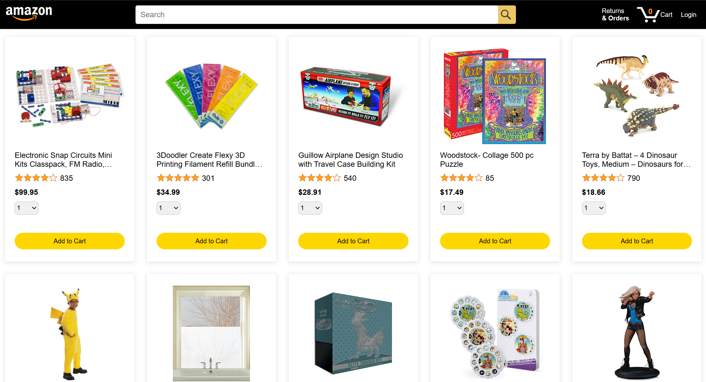 | 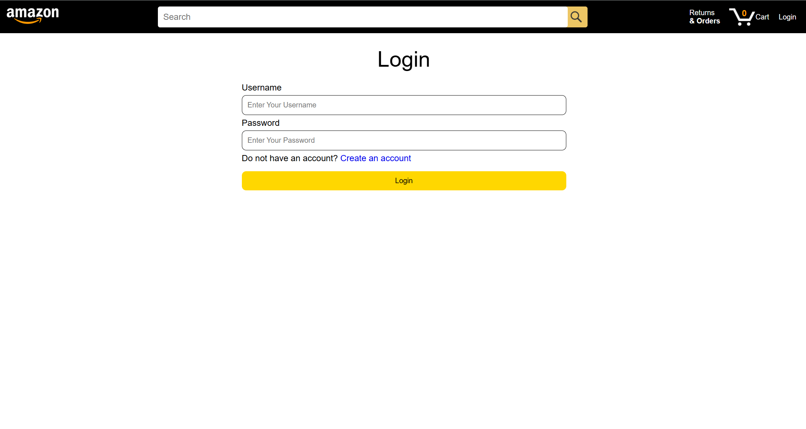 | 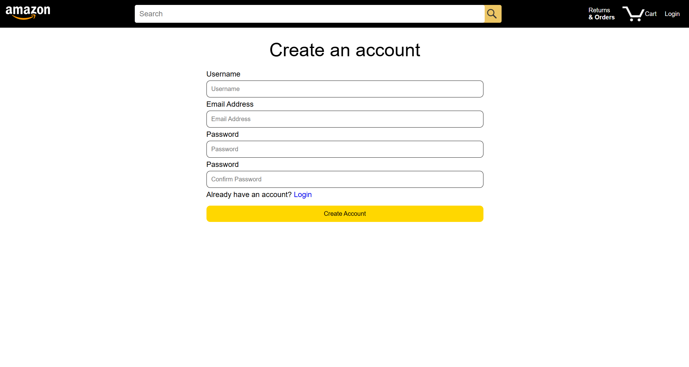 |

| Screenshot 4 | Screenshot 5 | Screenshot 6 |
|--------------|--------------|--------------|
| 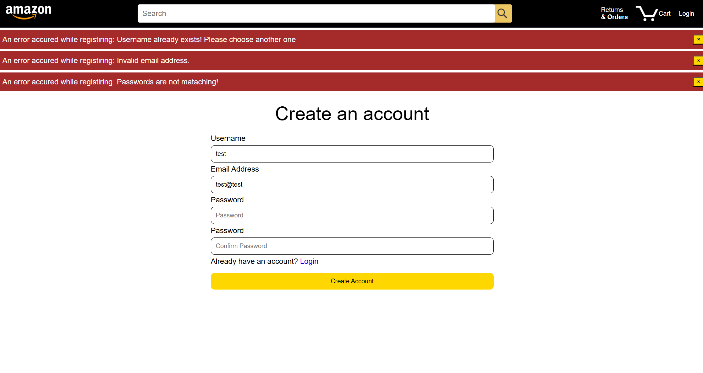 | 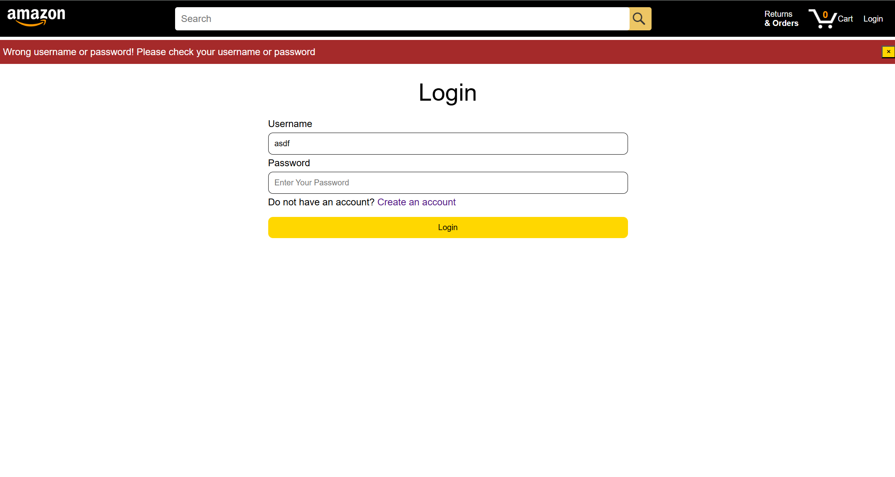 | 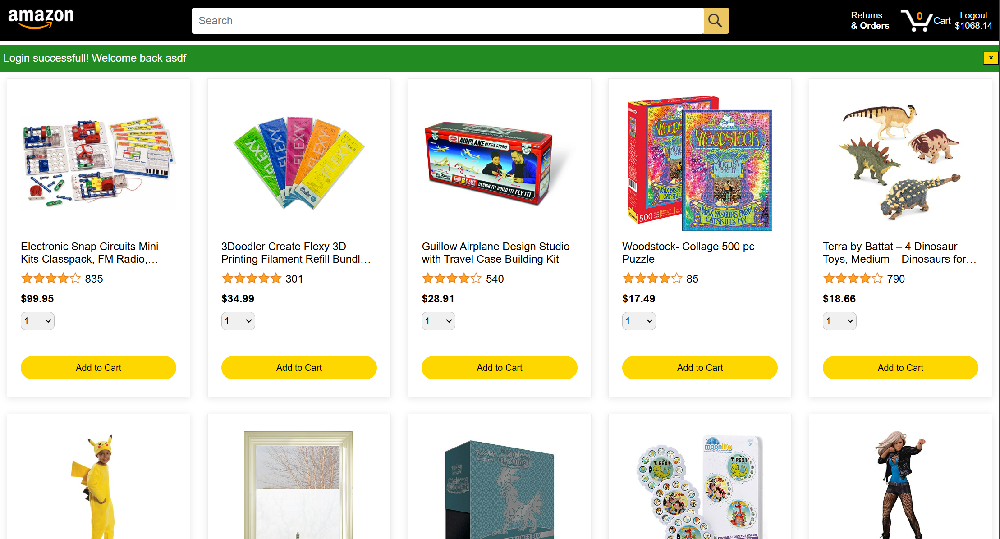 |

| Screenshot 7 | Screenshot 8 | Screenshot 9 |
|--------------|--------------|--------------|
| 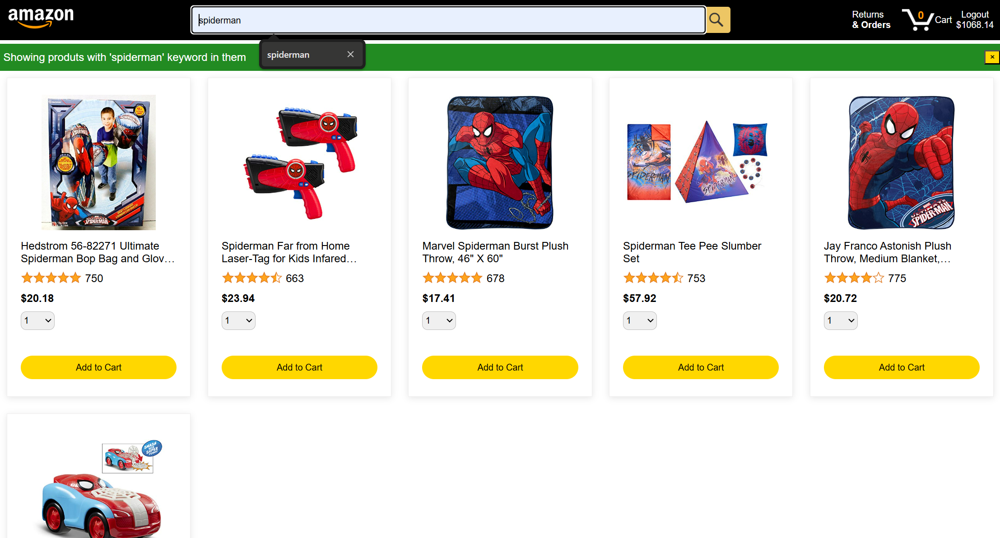 | 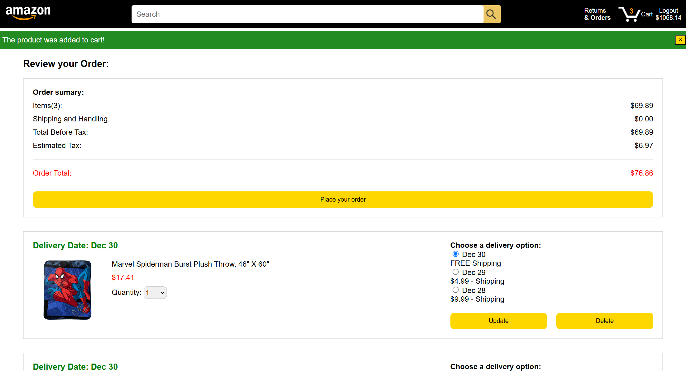 | 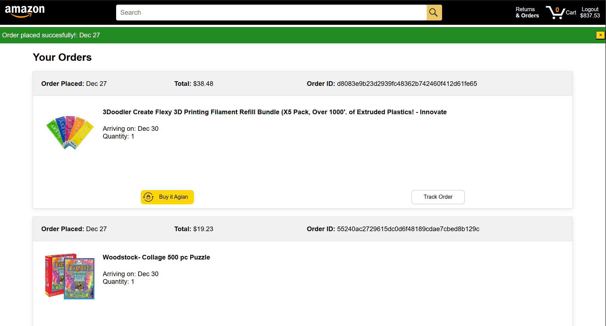 |

| Screenshot 10 | Screenshot 11 | Screenshot 12 |
|---------------|---------------|---------------|
| 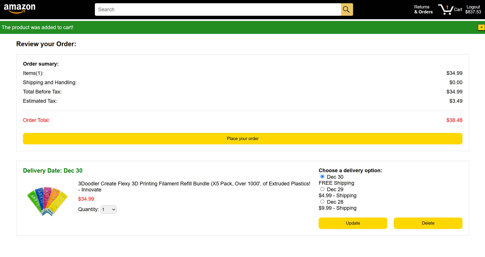 |  | 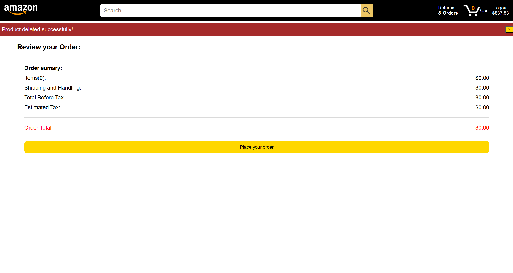 |

| Screenshot 13 |
|---------------|
| 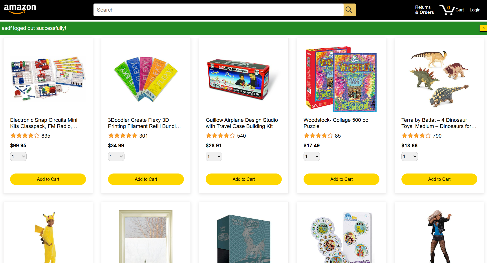 |

---

## Features

- Search for products using a search bar.
- Add, edit, and manage products.
- Pagination for product listings.
- User authentication (Flask-Login).
- Secure password handling (Flask-Bcrypt).
- Database management with SQLAlchemy.

---

## Requirements

To run this project, you need the following dependencies installed:

- Python 3.8 or above
- Flask==3.1.0
- Flask-Bcrypt==1.0.1
- Flask-Login==0.6.3
- Flask-SQLAlchemy==3.1.1
- Flask-WTF==1.2.2
- And other dependencies listed in `requirements.txt`.

---

## Installation

1. **Clone the Repository:**
   ```bash
   git clone https://github.com/hasibullahmohmand/amazon-project-with-flask.git
   cd amazon-project-with-flask
   ```

2. **Set Up a Virtual Environment:**
   ```bash
   python -m venv venv
   source venv/bin/activate   # On Windows: venv\Scripts\activate
   ```

3. **Install Dependencies:**
   ```bash
   pip install -r requirements.txt
   ```

4. **Create an Instance Folder:**
   Create an `instance/` directory in side the amazon-project-with-flask directory to store your database and secret configurations.

5. **Set Up the Database:**
   - If using SQLite set the `DATABASE_URL` in the `.env` file:
     ```plaintext
     DATABASE_URL=sqlite:///<database_name>
     ```

6. **Run the Application:**
   ```bash
   python app.py
   ```
